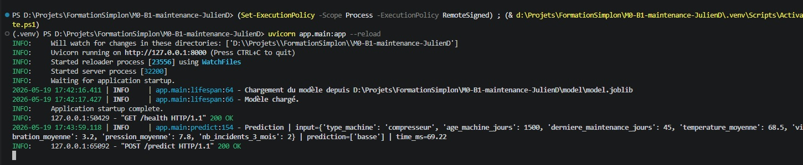
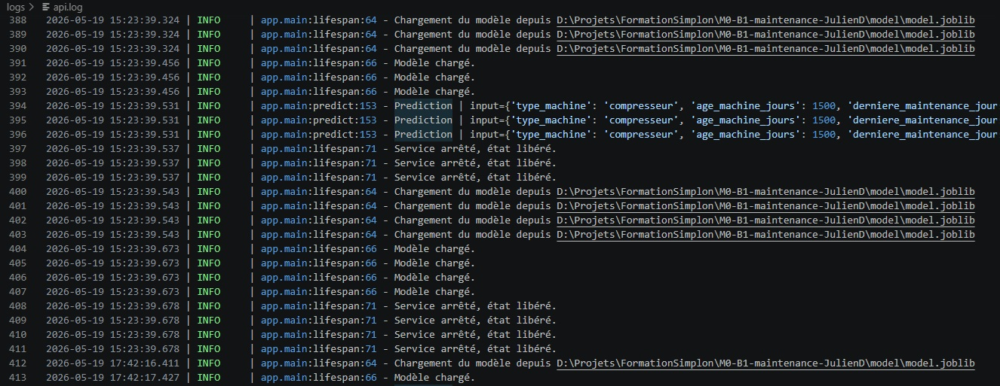
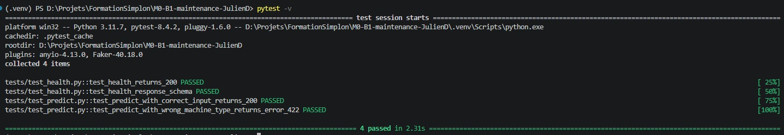
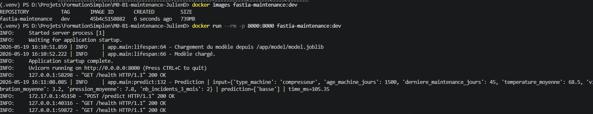

# M0-B1 — Service de criticité maintenance prédictive

Permet d'appeler un modèle de classification d'anomalie via Fast API 

## Organisation du repo

```
M0-B1-maintenance-JulienD/
├── app/
│   ├── __init__.py
│   ├── main.py             ← FastAPI : /health (✅ fonctionnel) + /predict (à compléter)
│   └── schemas.py          ← Pydantic : MachineInput, PredictionResponse
├── data/
│   ├── generate_dataset.py ← script de régénération du dataset (déjà exécuté)
│   └── maintenance_data.csv ← dataset synthétique 6 500 lignes
├── model/
│   ├── train_baseline.py   ← script d'entraînement (déjà exécuté)
│   └── model.joblib        ← modèle pré-entraîné, ~6.6 Mo (à charger au démarrage)
├── tests/
│   ├── __init__.py
│   └── test_health.py      ← test pytest fonctionnel au clone (✅)
├── Dockerfile              ← squelette commenté à compléter
├── requirements.txt        ← dépendances de développement
├── requirements.txt        ← dépendances de build (Docker)
├── .gitignore
├── .dockerignore
└── README.md               ← (ce fichier)
```

## ⚙️ Pré-requis

- Python **3.11+**
- Un environnement virtuel **activé** (cf. mini-cours `01_Setup_environnement_essentiel.md`
  du brief P0)

## Tache 1 : préparer l'environnment et lancer

```bash
# 1. Installer les dépendances dans ton env virtuel activé
pip install -r requirements.txt

# 2. Lancer l'API en mode dev (rechargement automatique sur modification)
uvicorn app.main:app --reload

# 3. Dans un autre terminal : lancer les tests
pytest -v
```

## Tache 3 : implémenter /predict

```python
@app.post("/predict", response_model=PredictionResponse)
def predict(item: MachineInput) -> PredictionResponse:
    # Check if model is loaded
    if "model" in state:
        start = time.perf_counter()

        # Call model from input
        X = pd.DataFrame([item.model_dump()])

        # Get prediction output
        prediction = state["model"].predict(X)
        proba = state["model"].predict_proba(X)[0]
        classes = state["model"].classes_

        duration = (time.perf_counter() - start) * 1000  # ms

        # Logging input, prediction and time
        logger.info(
                "Prediction | input={} | prediction={} | time_ms={:.2f}",
                item.model_dump(),
                prediction,
                duration
            )

        # Return PredictionResponse class
        return PredictionResponse(
                        criticite=prediction[0],
                        probabilites=dict(zip(classes, proba)),
                    )
    else:
        raise HTTPException(
                status_code=501,
                detail=(
                    "Model is not loaded - "
                    "UNable to call prediction."
                ),
        )
```



### Tâche 4 : Logging Loguru

Ajout d'un fichier de log dans la fonction lifespan exécutée au démarrage

```python
@asynccontextmanager
async def lifespan(app: FastAPI):
    """Charge le modèle au démarrage, libère à l'arrêt.

    Args:
        app: instance FastAPI.
    """

    # Log file initialisation
    logger.add(
            "logs/api.log",
            rotation="5 MB",
            retention="7 days",
            compression="zip",
            level="INFO",
            enqueue=True,
        )

    if not MODEL_PATH.is_file():
        logger.error(
            f"Modèle introuvable : {MODEL_PATH}. "
            f"Lance d'abord : python model/train_baseline.py"
        )
        raise RuntimeError(f"Modèle introuvable : {MODEL_PATH}")

    logger.info(f"Chargement du modèle depuis {MODEL_PATH}")
    state["model"] = joblib.load(MODEL_PATH)
    logger.info("Modèle chargé.")

    yield

    state.clear()
    logger.info("Service arrêté, état libéré.")
```



### Tâche 5 : Tests pytest pour /predict

Ajout d'un module de test test_predict.py contenant :

```python
"""Tests fonctionnels de l'endpoint /predict.

Permet de tester la sortie dans dans le cas valide et dans le cas d'un type de machine invalide.
"""

from __future__ import annotations

from fastapi.testclient import TestClient

from app.main import app


def test_predict_with_correct_input_returns_200() -> None:
    """L'endpoint /predict doit répondre 200 OK si l'entrée est correcte."""
    with TestClient(app) as client:
        data_ok = {"age_machine_jours": 1500,
                   "derniere_maintenance_jours": 45,
                   "nb_incidents_3_mois": 2,
                   "pression_moyenne": 7.8,
                   "temperature_moyenne": 68.5,
                   "type_machine": "compresseur",
                   "vibration_moyenne": 3.2}
        
        response = client.post("/predict", json=data_ok)
        assert response.status_code == 200
        body = response.json()
        sum_proba = sum(body["probabilites"].values())
        assert abs(sum_proba-1.0) < 0.01
        
        # A voir : modèle déterministe?
        assert body["criticite"] == "basse"
        assert body["probabilites"]["basse"]==0.97
        assert body["probabilites"]["moyenne"]==0.03
        assert body["probabilites"]["haute"]==0


def test_predict_with_wrong_machine_type_returns_error_422() -> None:
    """L'endpoint /predict doit retourner une erreur 422  si le type de machine est incorrect."""
    
    with TestClient(app) as client:
        data_ko = {"age_machine_jours": 1500,
                   "derniere_maintenance_jours": 45,
                   "nb_incidents_3_mois": 2,
                   "pression_moyenne": 7.8,
                   "temperature_moyenne": 68.5,
                   "type_machine": "presse_agrume",
                   "vibration_moyenne": 3.2}
        
        response = client.post("/predict", json=data_ko)
        body = response.json()
        print(body)
        assert response.status_code == 422    
        assert body["status"] == "ko"
        assert "Erreur sur 'type_machine'" in body["message"]
```



### Tâche 6 : Conteneurisation Docker

Création d'un requirements simplifié

```requirements
# API + serveur
fastapi>=0.115,<1
uvicorn>=0.32,<1

# Validation
pydantic>=2.10,<3

# ML : doit correspondre à la version utilisée pour entraîner model.joblib
scikit-learn>=1.7,<2
joblib>=1.5,<2
numpy>=2,<3
pandas>=2.2,<4

# Journalisation (préférée au logging stdlib)
loguru>=0.7,<1
```

Et d'un Dockerfile

```docker
# Versions testées : Docker 24+, image python:3.11-slim
FROM python:3.11-slim

# Installer curl
RUN apt-get update && apt-get install -y curl \
    && rm -rf /var/lib/apt/lists/*

# Créer l'utilisateur AVANT toute utilisation
RUN useradd -m appuser

WORKDIR /app

# Dépendances d'abord (cache des couches)
COPY requirements_docker.txt .
RUN pip install --no-cache-dir -r requirements_docker.txt

# Code applicatif
COPY app/ ./app/
COPY model/ ./model/

# Donner les droits à l'utilisateur
RUN chown -R appuser:appuser /app

# Passer en non-root
USER appuser

EXPOSE 8000
```

```bash
(.venv) PS D:\Projets\FormationSimplon\M0-B1-maintenance-JulienD> docker images fastia-maintenance:dev    
REPOSITORY           TAG       IMAGE ID       CREATED         SIZE
fastia-maintenance   dev       45b4c5150882   6 seconds ago   739MB
```


